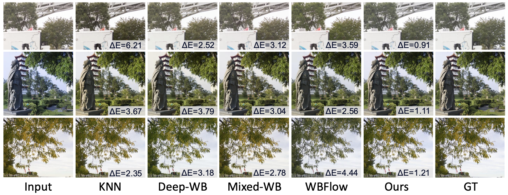
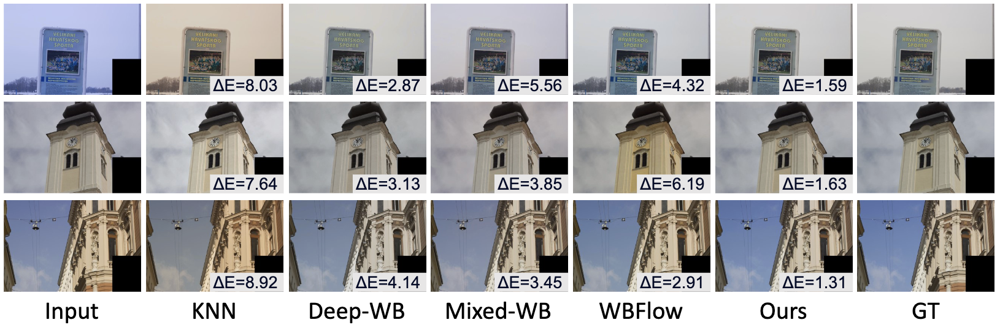
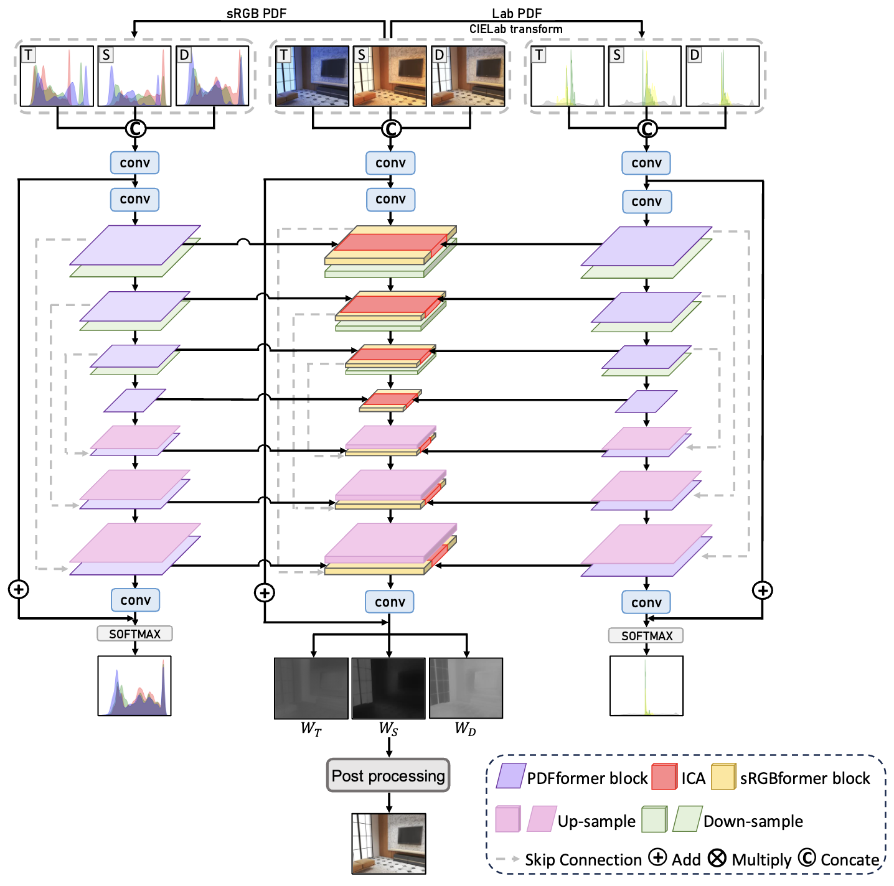

# ABC-Former: Auxiliary Bimodal Cross-domain Transformer with Interactive Channel Attention for White Balance
Pytorch Implementation of "ABC-Former: Auxiliary Bimodal Cross-domain Transformer with Interactive Channel Attention for White Balance."

## Abstract
The primary goal of white balance (WB) for sRGB images is to correct inaccurate color temperatures, making images exhibit natural, neutral colors. While existing WB methods achieve reasonable results, they are limited by the global color adjustments applied during a camera’s post-sRGB processing and the restricted color diversity in current datasets. This often leads to suboptimal color correction, particularly in images with pronounced color shifts. To address these limitations, we propose an Auxiliary Bimodal Cross-domain Transformer (ABC-Former) that enhances WB correction by leveraging complementary knowledge from multiple modalities. ABC-Former employs two auxiliary models to extract global color information from CIELab and RGB color histograms, complementing the primary model’s sRGB input processing. We introduce an Interactive Channel Attention (ICA) module to facilitate cross-modality knowledge transfer, integrating calibrated color features into image features for more precise WB results. Experimental evaluations on benchmark WB datasets show that ABC-Former achieves superior performance, outperforming state-of-the-art WB methods.

## Requirements
1. Python 3.8.15
2. pip install virtualenv
3. virtualenv awb
4. source awb/bin/activate
5. pip install torch==2.2.2 torchvision==0.17.2 torchaudio==2.2.2 --index-url https://download.pytorch.org/whl/cu121
6. pip install opencv-python
7. pip install timm
8. pip install scikit-image
9. pip install scikit-learn
10. pip install matplotlib
11. pip install einops

## ABC-Former
### Framework

### Training

### Testing

### AWB Results

## Extension to the Multi-illuminant Task: ABC-FormerM
### Framework

### Training

### Testing
